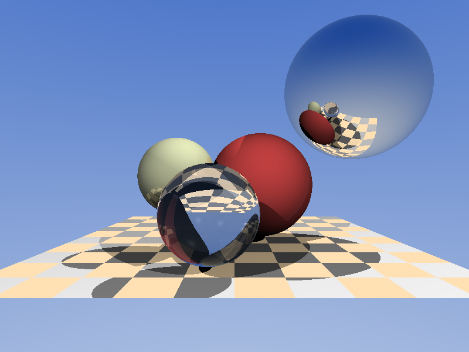

# Understandable RayTracing in 256 lines (C++)

**Source:** ["Understandable RayTracing in 256 lines"](https://github.com/ssloy/tinyraytracer/wiki)
by Dmitry Sokolov, from the C++ section of
[practical-tutorials/project-based-learning](https://github.com/practical-tutorials/project-based-learning).
I built to the tutorial's overall shape -- spheres with a shared material model,
Whitted-style recursive reflection/refraction, point lights with shadow rays --
but every file here is written from my own understanding of how the pieces have
to fit together, not transcribed from the reference source. Two deliberate
departures from the original, both explained below: no image-based environment
map, and total internal reflection is a checked condition instead of a silent
sentinel value.

## What it is

A recursive ray tracer with a REPL-free, single-shot renderer: point the camera
down -z, trace a ray per pixel, write a PPM.

- `include/geometry.hpp` -- `Vec3f` (the one vector type the whole project
  needs: points, directions, and colors) and `Albedo`, a 4-weight struct
  (diffuse / specular / reflection / refraction) kept as its own type
  specifically so it can't be silently swapped for a color in a constructor
  call -- the two are both "4ish floats" and a mixed-up argument order would
  otherwise compile fine and render silently wrong.
- `include/scene.hpp` -- `Material`, `Light`, `Sphere::ray_intersect`, and the
  two vector-optics primitives, `reflect` and `refract`.
- `include/render.hpp` / `src/render.cpp` -- `scene_intersect` (nearest hit
  across spheres and a checkerboard floor plane), `cast_ray` (the recursive
  shading loop), `sky_color`, and `render` (the pixel loop and PPM writer).
- `tests/test_raytracer.cpp` -- 25 hand-rolled cases (no GoogleTest install
  available), covering vector math, reflect/refract including total internal
  reflection, sphere intersection (including the ray-starts-inside case),
  nearest-hit selection, shadow rays, and that a mirror's reflection actually
  carries the color of what it's pointed at.
- `tools/ppm_to_png.py` -- a ~50-line PNG encoder using only `zlib`/`struct`
  from the standard library, so the rendered proof-of-work
  (`renders/scene.png`) is something GitHub can actually preview inline
  instead of a PPM nobody's browser renders.

## Run it

```bash
cd 2026-08-08-cpp-raytracer
make test                                   # 25 cases
make run                                     # renders/out.ppm, 1024x768
make run WIDTH=400 HEIGHT=300 OUT=renders/quick.ppm
python3 tools/ppm_to_png.py renders/out.ppm renders/out.png
```



## What it actually teaches

- **One shading function can express diffuse, mirror, and glass because
  they're the same recursive formula with different weights, not three
  different code paths.** `cast_ray` always computes all four terms --
  local diffuse+specular, a recursive reflection trace, a recursive
  refraction trace -- and blends them by `material.albedo`. A perfectly
  matte rubber ball just has `reflection`/`refraction` weight 0, so the
  recursive calls still happen but contribute nothing; a mirror has
  `diffuse`/`refraction` at 0 and a huge specular exponent. There's no
  `if (material.type == MIRROR)` anywhere -- the branching that *does*
  exist (`if (albedo.refraction > 0)`) is purely a performance guard against
  tracing a refraction ray no material will ever use, not a correctness
  requirement. `test_mirror_reflects_scene_color` pins this: it's the exact
  same `cast_ray` function that shades the matte rubber sphere, called on
  a sphere whose only difference is its `Material`, and the result visibly
  carries the color of whatever the mirror is pointed at.
- **The bias epsilon has to point away from the surface on whichever side
  the new ray is actually going, which is the *opposite* rule for
  reflection/diffuse rays versus a refraction ray entering the object.**
  `reflect_orig`/`shadow_orig` nudge along `+N` when the new direction has
  positive dot with `N` (leaving the surface on the outward side) and `-N`
  otherwise. Refraction rays are the case that makes this matter: a ray
  entering glass has a *negative* dot with the outward normal by design
  (it's bending inward), so biasing by `+N` there would push the recursive
  ray's origin back into the same surface it just crossed, at floating-point
  distance zero, and `scene_intersect` would immediately re-hit the sphere
  the ray is supposed to be leaving -- band-like "shadow acne" artifacts,
  or the classic all-black glass sphere if it happens on every bounce.
  Every offset origin in `cast_ray` (`reflect_orig`, `refract_orig`,
  `shadow_orig`) uses this same sign check for that reason.
- **Total internal reflection is not an edge case to hand-wave; it's a
  real branch with no correct refracted ray to return.** The original
  tutorial's `refract` returns a sentinel `Vec3f(1,0,0)` when the
  discriminant goes negative and just lets the caller trace that direction
  anyway -- harmless *only* by luck, because their demo scene's glass
  sphere never happens to get hit at an angle steep enough to trigger it.
  I didn't want a correctness property that depends on which angles a
  particular demo scene happens to use, so `refract` here takes a `bool&
  tir` out-parameter, and `cast_ray` checks it explicitly: on total
  internal reflection, the light that would have transmitted, reflects
  instead (`refract_color = reflect_color`), which is what actually happens
  physically at the critical angle. `test_reflect_refract`'s "steep-angle
  ray inside glass hits total internal reflection" case is intentionally
  the scenario the original code shape gets wrong: a ray leaving glass
  (`eta_i=1.5`) at a shallow grazing angle, past the ~41.8-degree critical
  angle for `n=1.5`.
- **A ray that starts inside a sphere needs its *far* root, not its near
  one, and that's one extra `if` rather than a special case.**
  `Sphere::ray_intersect` solves the quadratic for both roots `t0`/`t1`
  along the ray, and when `t0` (the near one) is negative -- the origin is
  already past it, i.e. inside the sphere -- it falls through to `t1`
  instead of reporting a miss. Without this, a refraction ray traced from
  just inside a glass sphere's own surface toward its far wall would
  report no intersection at all, because the "correct" near root is
  behind where the ray started. `test_sphere_intersect`'s "ray from inside
  a sphere hits the exit point" pins exactly this, checking the returned
  distance is exactly the radius (a ray from a sphere's own center always
  exits at `t = radius`).
- **Clamping each color channel independently discolors bright highlights;
  rescaling by the brightest channel dims them toward white instead.**
  Three overlapping point lights can easily push a specular highlight's
  red channel to, say, 1.4 while green and blue stay near 0.9. Clamping
  each channel to `[0,1]` separately would crush red to 1.0 and leave
  green/blue lower, shifting the highlight's hue toward yellow-white for
  no physical reason. `render`'s final loop instead finds `max(r,g,b)` and
  divides the whole color by it when that max exceeds 1, preserving the
  color's *ratio* and only reducing its brightness -- the same trick
  cameras and renderers use to avoid clipped-channel color casts on bright
  specular points.
- **A plane competes for "nearest hit" the same way a second sphere would,
  which is why the floor and the spheres share one `std::min` comparison
  instead of "check spheres, then check the floor."** `scene_intersect`
  computes `spheres_dist` and `checkerboard_dist` independently and takes
  whichever is smaller, so a sphere sitting in front of the checkerboard
  correctly occludes it and vice versa -- there's no ordering assumption
  baked into the code about which type of geometry is "closer to the
  camera" in general. `test_scene_intersect_picks_nearest` covers the
  sphere-vs-sphere version of the same rule.

## What surprised me writing the tests, not the renderer

Two of my first test-writing attempts failed against a renderer that was
already correct, because I'd mentally placed geometry wrong -- worth noting
since it's a different kind of mistake than a code bug:

- My first shadow test put the occluder at `z=+10` relative to a light at
  `z=+100` and a surface point at `z=-5`, meaning "behind the light" in my
  head but *on the line segment* to the light in the actual coordinates
  (`-5 < 10 < 100`). The renderer correctly shadowed it; I'd misjudged which
  side of the surface point counts as "toward the light."
- My first mirror test tried to hand-pick an oblique camera angle so the
  reflection would land on a second sphere, without actually solving the
  reflection geometry -- it happened to miss. The fix was to stop guessing
  angles and use the one case `reflect()` makes exact: a dead-center hit
  reflects straight back the way the ray came, so placing the target sphere
  directly behind the camera on the same axis needs no trigonometry at all.

## What I'd add next (stretch goals I skipped for scope)

- **An actual image-based environment map.** The tutorial's background is a
  photo sampled by ray direction; I used a two-color procedural sky gradient
  instead, specifically to avoid pulling in an image-decoding dependency
  (no `stb_image.h`, no package manager in this environment). The tradeoff
  is explicit: less visually interesting background, zero external
  dependencies.
- **Anti-aliasing.** One ray per pixel means every sphere edge is visibly
  jagged at any resolution I can render in a few hundred milliseconds.
  Supersampling (a few jittered rays per pixel, averaged) is a small change
  to `render`'s inner loop.
- **Soft shadows.** Lights are points, so every shadow edge is a hard line.
  Area lights (sample a few points on a disc, average occlusion) are the
  standard next step and reuse the existing shadow-ray machinery as-is.
- **A BVH or grid.** `scene_intersect` is O(objects) per ray, fine for four
  spheres and a plane, not fine for a scene with hundreds of objects.
- **Multithreading.** The pixel loop in `render` has zero cross-pixel
  dependencies and would parallelize with nothing more than an
  `#pragma omp parallel for` or a manual row-range split across `std::thread`.
